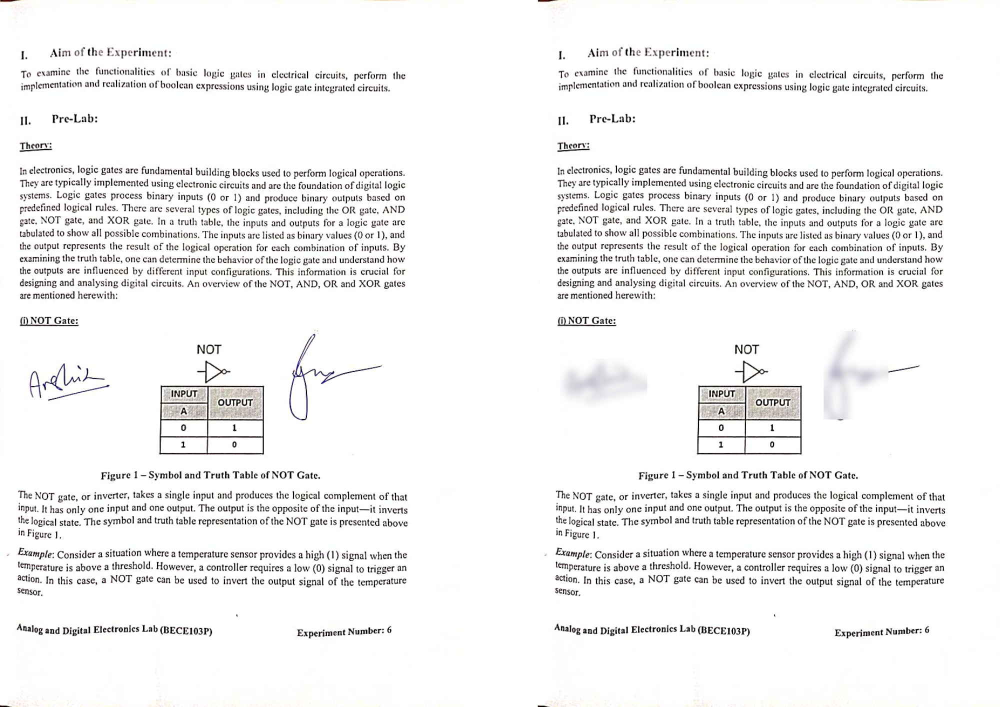
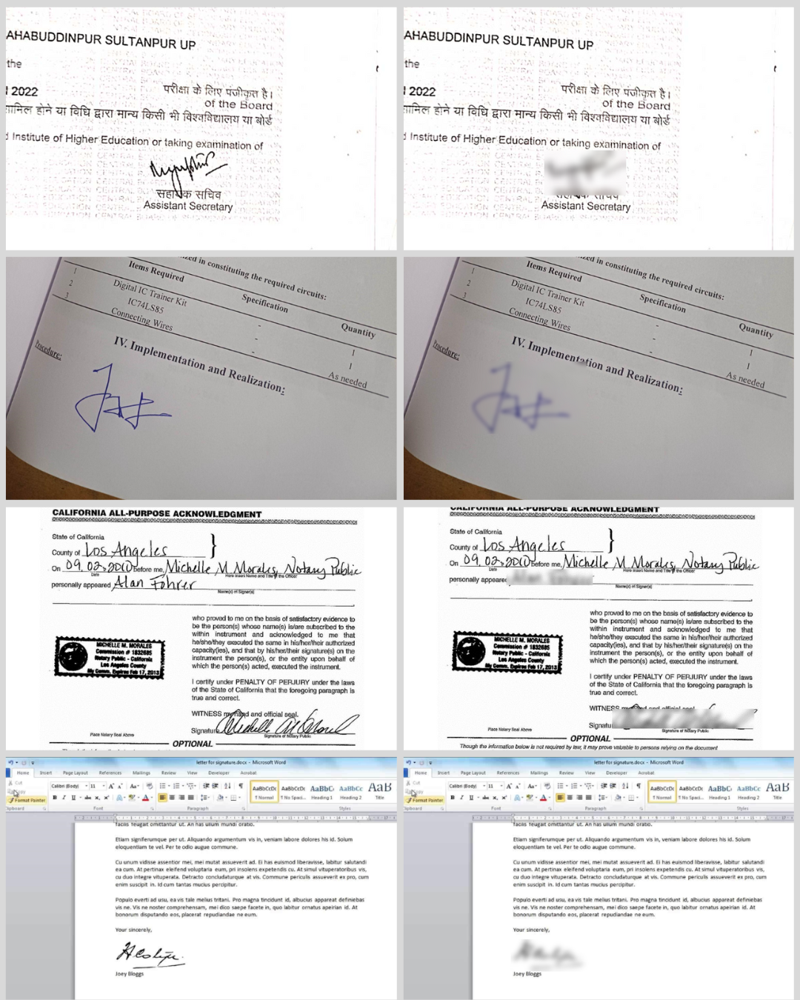
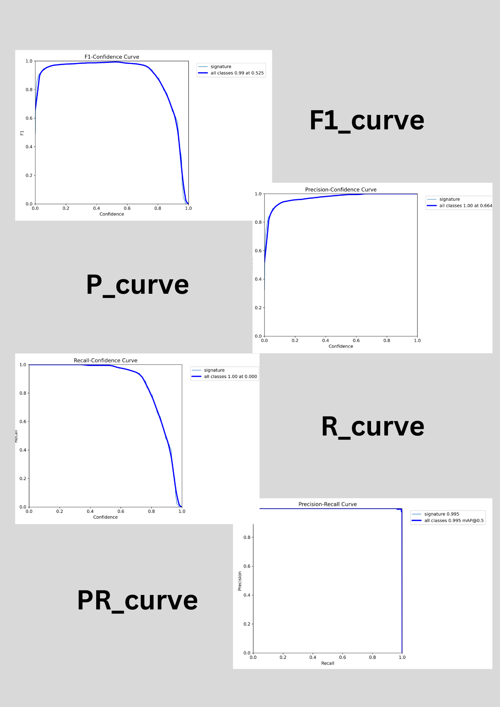

# Signature Detection and Blurring

This repository contains a Flask application capable of detecting and blurring signatures within images using a custom-trained model. The model was trained on a self-labeled dataset, ensuring precise detection and blurring results. 


## Installation

1. Clone the repository:

    ```bash
    git clone https://github.com/anshikkumartiwari/siginature-detection-blur.git
    ```

2. Navigate to the project directory:

    ```bash
    cd siginature-detection-blur
    ```

3. Install the required dependencies:

    ```bash
    pip install -r requirements.txt
    ```

## Running the Application

After installing the dependencies, you can run the application by executing the following command:

```bash
python app.py
```

Once the server is running, open your web browser and navigate to `http://127.0.0.1:5000`. You can upload an image, and the app will detect and blur signatures within the uploaded image.

## Demo

### Signature Detection

Below is a demo of the program detecting and blurring signatures in an image.




### Model Training Metrics

Here are the precision (P), recall (R), precision-recall (PR), and F1-score curves from the model training:



## Contributing

Feel free to submit issues or pull requests if you would like to contribute to this project!
